# HuskyMingle Android

> Native Jetpack Compose client for HuskyMingle — a campus "super-app" that consolidates the social feed, peer matching, threaded discussions, marketplace, Stories, NEU course catalog, and private Circles into a single brand-native Android surface against a shared NestJS backend.

[](https://github.com/Kaustubha-09/HuskyMingle-android/actions)
[](https://kotlinlang.org)
[-3DDC84)](https://developer.android.com)
[](https://developer.android.com/jetpack/compose)
[](https://m3.material.io)
[](LICENSE)

<p align="center">
  <em>Logo &amp; adaptive launcher icon are generated at build time from <code>res/drawable/ic_launcher_*.xml</code>.</em>
</p>

Northeastern students juggle 6+ apps to handle campus life — Instagram for posts, Discord for clubs, Facebook Marketplace for textbooks, Handshake for jobs, Bumble BFF for connections, separate apps for events and study groups. HuskyMingle consolidates those touchpoints into a single, brand-native Android app tied to a verified `.edu` identity, so students can post, match with peers, browse courses, run private Circles, sell textbooks, and DM classmates without leaving the app. This repository is the **native Android client** in a polyglot stack — the SwiftUI iOS app lives in [`HuskyMingle-ios`](https://github.com/Kaustubha-09/HuskyMingle-ios) and the NestJS backend, Next.js web app, and Postgres database live in the sibling [`HuskyMingle-web`](https://github.com/Kaustubha-09/HuskyMingle-web) repo.

---

## Screenshots

> Captured at 390 × 844 (iPhone 14 Pro viewport) via the shared NestJS backend.

| Login | Register | Feed |
|:-:|:-:|:-:|
| 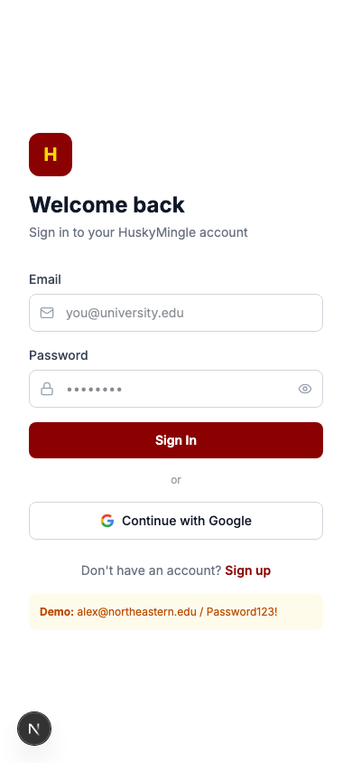 | 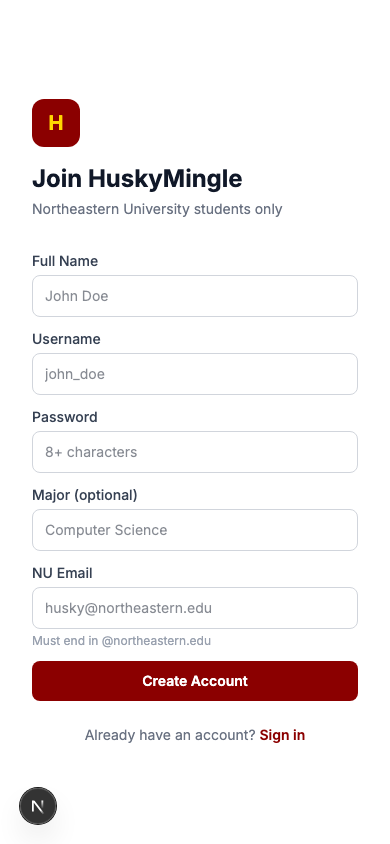 | 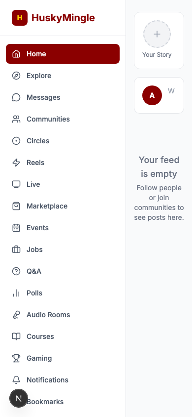 |

| Explore | Messages | Communities |
|:-:|:-:|:-:|
| 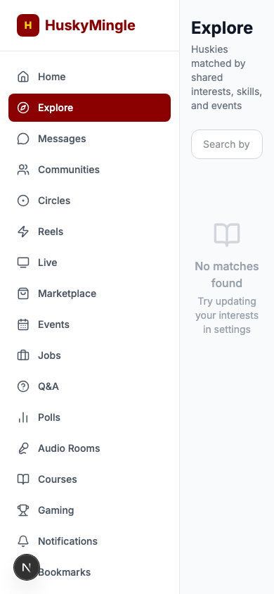 | 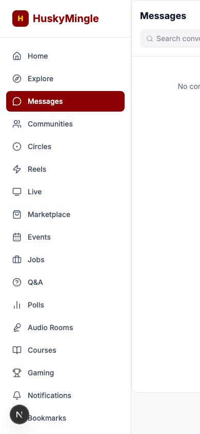 | 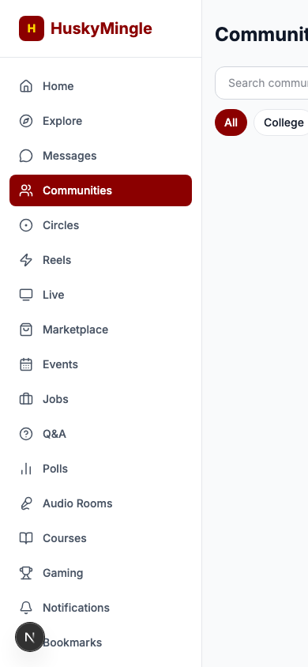 |

| Circles | Marketplace | Events |
|:-:|:-:|:-:|
| 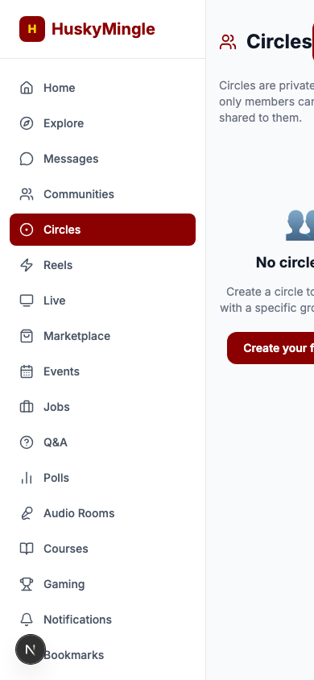 | 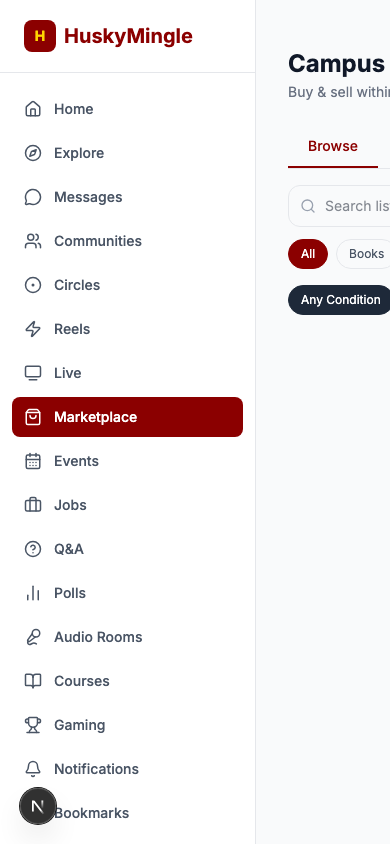 | 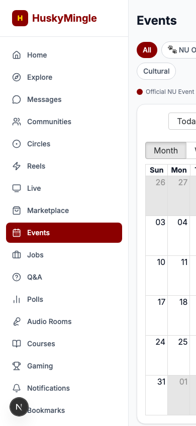 |

| Gaming | Jobs | Courses |
|:-:|:-:|:-:|
| 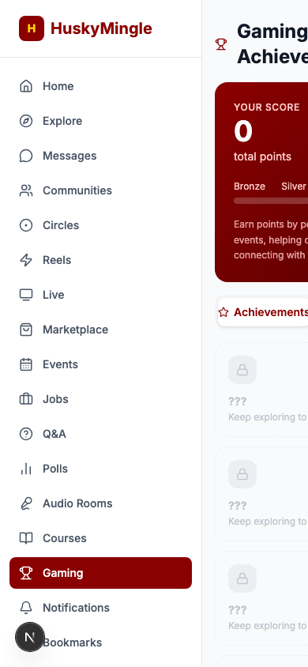 | 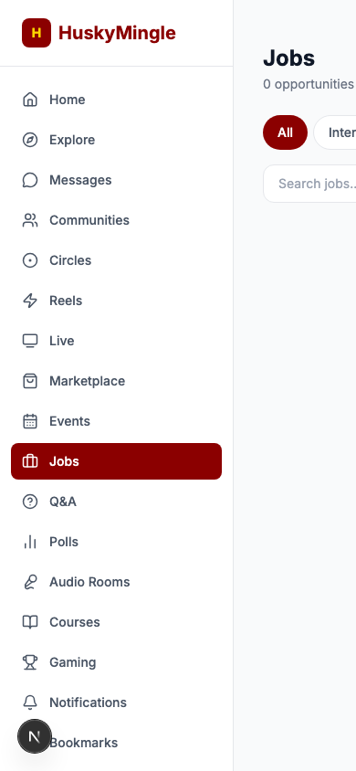 |  |

---

## Features

### Identity & Security
- **Verified onboarding** — `.edu` email → 6-digit code → interests/skills/languages personalization.
- **DataStore-backed tokens** — access + refresh JWT stored in AndroidX `DataStore<Preferences>` under `auth_prefs`; user-scoped preferences (biometric flag, current mode, enrolled courses, Stories/Circles blobs) in a separate `user_prefs` store.
- **Biometric app-lock** — AndroidX `BiometricPrompt` with `BIOMETRIC_STRONG | DEVICE_CREDENTIAL` allowed authenticators; toggleable in Settings, gated by `BiometricManager.canAuthenticate` so the toggle disables itself when no biometrics are enrolled; hard fallback to logout if the user cancels.
- **`usesCleartextTraffic` scoped to debug builds** — release builds will route to HTTPS only.

### Social Surface
- **Stories ring** — 24-hour ephemeral photo Stories on top of the feed; `ActivityResultContracts.PickVisualMedia` composer (no `READ_MEDIA_IMAGES` permission needed on API 33+), JPEG persisted to `files/stories/`, metadata mirrored to DataStore as JSON, automatic reap-on-launch.
- **Threaded comments** — Reddit-style nested replies on every post, depth-indented `CommentRow`, "Replying to @x" pill in the input bar, optimistic reply-splicing into the parent thread.
- **Followers / Following lists** — tap any stat on a profile to navigate into a paginated user list.
- **Tap-through profiles** — every avatar in Feed / Explore / Marketplace routes to the user's public profile.
- **Bumble-style mode switcher** — `Study buddy · Project partner · Friend · Network` with a persistent badge on every profile, animated 4-pill `ModeSwitcher` on the user's own profile.

### Discovery
- **Smart matching** — server-computed match score; the existing match decoder mirrors the iOS defensive client-side normalization (clamp `0..1` and `0..100` shapes into a single `[0, 100]` range).
- **NEU course catalog** — 50 real NEU courses (CS, DS, CY, MATH, EECE, ENGW, PHIL, PSYC, ARTG, INSH, JRNL, ENTR, MGMT) bundled as `assets/neu_courses.json`, searchable + department-filtered, with client-side enrollment toggle persisted to DataStore.
- **Circles** — Discord-style private groups with emoji avatars; created entirely client-side until the backend supports many-participant conversations. Members are stored as `@handle` strings; list/detail/create flow lives under `ui/circles/`.

### Commerce
- **Marketplace** — peer-to-peer listings tied to verified users, hero image with Coil disk cache, seller card, contact CTA, tap-through to seller profile.

### Reach
- **One-tap navigation to 14 secondary surfaces** — Events, Jobs, Communities, Polls, Q&A, Audio Rooms, Reels, Live, Gaming, Bookmarks, Notifications, Search, Circles, Courses — wired via the `MainShell` drawer.

### Brand & Polish
- **Husky design tokens** — full color palette (`HuskyRed`, `HuskyRedDeep`, `HuskyGold`, `HuskyCoral`, semantic success/warning/info), 8-level `HMSpacing` scale (4/8/12/16/20/24/32/48), `HMRadius` (8/12/16/20/pill), `hmCardShadow` / `hmFloatShadow` / `hmBrandShadow` modifiers. Exposed via `HMTheme.spacing` / `HMTheme.radius` `CompositionLocal`.
- **Branded launcher icon** — adaptive `ic_launcher` with HM monogram on a husky-red gradient + gold accent dot, generated from vector drawables (no PNGs).
- **Animated splash** — 1.4 s minimum hold with the logo + wordmark + tagline; the window background is pre-painted husky-red in `themes.xml` so there's no white flash before Compose initializes.
- **AutoMirrored icons** — every chat / send / logout / back icon uses the AutoMirrored variants so RTL locales render correctly.

---

## Architecture

```
┌──────────────────────────────────────────────┐
│            Composable Screens                │  ← presentation only
│  FeedScreen · ExploreScreen · ProfileScreen…│
└──────────────────────────────────────────────┘
                  ▲ collectAsState()
                  │
┌──────────────────────────────────────────────┐
│              ViewModels                      │  ← state + orchestration
│  FeedVM · ExploreVM · ChatVM · AuthVM        │
│  UserProfileVM · PostDetailVM ·              │
│  MarketplaceItemVM · UserListVM              │
└──────────────────────────────────────────────┘
                  ▲
                  │
┌──────────────────────────────────────────────┐
│       Services / Stores (singletons)         │  ← side effects
│  RetrofitClient · ApiService                 │
│  AuthDataStore · UserPreferences             │
│  BiometricService                            │
│  StoriesStore · CirclesStore                 │
│  CourseCatalogService                        │
└──────────────────────────────────────────────┘
                  ▲
                  │
┌──────────────────────────────────────────────┐
│         Data classes (Gson @Serialized)      │
│  User · Post · Comment · MatchUser · Message │
│  MarketplaceItem · HMStory · HMCircle ·      │
│  Course · Event · Job · Community · …        │
└──────────────────────────────────────────────┘
```

Three rules every file obeys:
1. **Composables contain presentation logic only** — no Retrofit calls, no JSON parsing, no business decisions. Everything comes in via a `StateFlow`.
2. **`ApiService` is the single Retrofit interface** — request building, auth header (`AuthInterceptor`), and 401 routing all live in `RetrofitClient`.
3. **Brand decisions live in `ui/theme/`** — `Color.kt`, `Spacing.kt`, `Shadow.kt`, `Type.kt`, `Theme.kt`. No `Color(0xFFxxxxxx)` literals outside this folder.

Dependency injection is a manual `Application` singleton (`HuskyMingleApp.kt`) — `authDataStore`, `userPreferences`, `storiesStore`, `circlesStore`, and `courseCatalog` are `lateinit` and accessed via `context.applicationContext as HuskyMingleApp`. This intentionally avoids Hilt to keep the dependency graph small and the cold-start cost low; if the app grows past ~50 ViewModels we'd revisit.

### Folder Structure

```
app/src/main/
├── AndroidManifest.xml             # FragmentActivity main, INTERNET perm
├── assets/
│   └── neu_courses.json            # 50 real NEU courses (bundled)
├── res/
│   ├── drawable/                   # ic_launcher_background / _foreground
│   ├── mipmap-anydpi-v26/          # Adaptive launcher icon XML
│   └── values/                     # colors / strings / themes
└── java/com/huskymingle/app/
    ├── HuskyMingleApp.kt           # Application; manual DI singletons
    ├── MainActivity.kt             # Single FragmentActivity, Compose entry
    ├── security/
    │   └── BiometricService.kt     # BiometricPrompt wrapper
    ├── data/
    │   ├── local/
    │   │   ├── AuthDataStore.kt    # JWT tokens (auth_prefs DataStore)
    │   │   ├── UserPreferences.kt  # Biometric flag, mode, enrolled
    │   │   │                       # courses, Stories/Circles JSON
    │   │   ├── StoriesStore.kt     # 24h ephemeral; files/stories/*.jpg
    │   │   ├── CirclesStore.kt     # Private groups; DataStore JSON
    │   │   └── CourseCatalogService.kt # Bundled NEU catalog loader
    │   ├── model/                  # User, Post, Comment, MatchUser,
    │   │                           # Message, MarketplaceItem, HMStory,
    │   │                           # HMCircle, Course, Event, Job …
    │   └── network/
    │       ├── ApiService.kt       # Retrofit interface — every endpoint
    │       └── RetrofitClient.kt   # OkHttp + AuthInterceptor + Gson
    │                               # @Volatile cachedToken — ANR-safe
    └── ui/
        ├── theme/                  # Color · Spacing · Shadow · Type ·
        │                           # Theme · HMTheme CompositionLocal
        ├── components/             # HuskyMingleLogo · AvatarView ·
        │                           # HMChip · HMPrimaryButton ·
        │                           # HMSecondaryButton ·
        │                           # HMMode · ModeSwitcher · ModeBadge
        ├── auth/                   # Splash, Login, Register, Verify,
        │                           # Onboarding, BiometricLock, AuthVM
        ├── navigation/             # AppNavigation, Screen sealed class
        ├── main/                   # MainShell (drawer + 5-tab bottom nav)
        ├── feed/                   # FeedScreen, PostDetailScreen, VMs
        ├── stories/                # StoriesRingView, CreateStory,
        │                           # StoryViewer
        ├── explore/                # ExploreScreen (matching)
        ├── messages/               # MessagesScreen, ChatScreen, ChatVM
        ├── marketplace/            # MarketplaceScreen, MarketplaceItem
        ├── profile/                # ProfileScreen, UserProfileScreen,
        │                           # UserListScreen
        ├── circles/                # CirclesScreen, CircleDetail,
        │                           # CreateCircle
        ├── courses/                # CoursesScreen, CourseDetail
        ├── settings/               # SettingsScreen (biometric toggle)
        └── (14 secondary surfaces) # events / jobs / communities /
                                    # polls / qa / gaming / audio /
                                    # reels / live / bookmarks /
                                    # notifications / search
```

This structure mirrors the iOS layout (data → ui → per-feature folders) so navigating between the two codebases is friction-free.

---

## Design System

Single source of truth: [`app/src/main/java/com/huskymingle/app/ui/theme/`](app/src/main/java/com/huskymingle/app/ui/theme/). Every color, spacing token, radius, and typography style flows from here — no `Color(0xFF...)` literals are allowed outside this folder.

### Brand Palette

| Token | Hex | Role |
|---|---|---|
| `HuskyRed` | `#8B0000` | Husky red — primary CTAs, brand mark |
| `HuskyRedDeep` | `#4A0000` | Brand gradient bottom |
| `HuskyRedLight` | `#BF3333` | Disabled / muted brand state |
| `HuskyCoral` | `#C81E1E` | Warm secondary, gold-gradient pair |
| `HuskyGold` | `#FFD700` | Accent dot, highlights |
| `HuskyGoldDark` | `#B8960A` | Pressed / hover gold |

Semantic: `SemanticSuccess #0FB882 · SemanticWarning #F29E07 · SemanticInfo #0DA3E8`. Light surfaces (`SurfaceLight #FFFFFF` / `SurfaceMutedLight #F1ECEA`) and dark surfaces (`SurfaceDark #14110F` / `SurfaceMutedDark #1E1A18` / `SurfaceVariantDark #2A2522`) drive the Material 3 `ColorScheme`.

### Type Scale (`HMTypography`)

System default font with Bold/SemiBold weights to approximate SwiftUI's `.rounded` design. Sizes mirror the iOS scale:

`displayLarge 34 · displayMedium 28 · displaySmall 22 · headlineMedium 20 · headlineSmall / titleLarge 17 · titleMedium 16 · titleSmall / labelLarge / bodyMedium 15 · bodySmall / labelMedium 13 · labelSmall 11`

### Spacing — `HMSpacing` (4-point grid)

`xxs 4 · xs 8 · sm 12 · md 16 · lg 20 · xl 24 · xxl 32 · xxxl 48`

### Radius — `HMRadius`

`sm 8 · md 12 · lg 16 · xl 20 · pill 999`

### Shadow Modifiers (`Shadow.kt`)

- `hmCardShadow()` — list cards
- `hmFloatShadow()` — modals, lifted CTAs
- `hmBrandShadow()` — primary buttons (husky-red glow)

### CompositionLocal

`HMTheme.spacing` and `HMTheme.radius` are exposed via Compose `CompositionLocal` so any Composable in the tree can read `HMTheme.spacing.md` without prop-drilling.

### Brand Mark

`HuskyMingleLogo(size:showWordmark:)` Composable — husky-red disc, white "HM" monogram, gold accent dot. Used on splash, login, and any surface that needs to assert the brand. The adaptive `ic_launcher` is a hand-drawn vector with the same composition.

---

## Tech Stack

| Layer | Choice | Why |
|---|---|---|
| UI | Jetpack Compose + Navigation-Compose | Declarative, Compose-only single-Activity app |
| Theme | Material 3 + custom `HMTheme` CompositionLocal | Material 3 baseline, husky palette layered on top |
| State | `androidx.lifecycle.ViewModel` + `StateFlow` | Same MVVM contract as iOS, no logic in `@Composable` |
| Async | Kotlin Coroutines + `viewModelScope` | `suspend` everywhere, no `RxJava`, no callbacks |
| Networking | Retrofit 2 + OkHttp 4 + Gson | Industry-standard, snake-case ↔ camelCase via `@SerializedName` |
| Auth storage | AndroidX `DataStore<Preferences>` (`auth_prefs`) | Async, flow-based, no `SharedPreferences` |
| Biometrics | AndroidX `BiometricPrompt` (`Class 3` + device credential) | Single sheet handles fingerprint / face / device PIN |
| Images | Coil 2 (`AsyncImage`, `SubcomposeAsyncImage`) | Coroutine-native, smaller than Glide |
| Local prefs | DataStore JSON blobs for Stories/Circles | Demo-grade, fast restore on launch |
| Bundled data | `assets/neu_courses.json` (50 courses) | No backend round-trip for the course catalog |
| Backend | NestJS REST API at `:3001` | Sibling backend repo; emulator hits `http://10.0.2.2:3001/api/v1/` |
| Min SDK | 26 (Android 8.0) | Adaptive icons, Java 8 lambdas, modern Compose APIs |
| Compile SDK | 35 (Android 15) | Latest stable API surface |

**Dependency footprint is intentionally narrow** — Compose BOM, Material Icons Extended, Navigation Compose, Lifecycle ViewModel, Retrofit + Gson + OkHttp logging, DataStore, Coil, AndroidX Biometric. No Hilt, no Room, no RxJava, no Glide. Single-Activity Compose-only — `MainActivity` is the only `Activity`, and it extends `FragmentActivity` so `BiometricPrompt` can attach.

---

## Getting Started

### Prerequisites

- macOS / Linux / Windows with Android Studio Koala (2024.1) or newer, **or** a standalone Android SDK with `cmdline-tools` + `platform-tools` + `emulator`.
- JDK 17 on `PATH` (`brew install openjdk@17` on macOS).
- An emulator AVD running API 26+ (Pixel 7, API 35, `system-images;android-35;google_apis;arm64-v8a` is the reference config).
- The companion NestJS backend running locally on port 3001 — emulator reaches the host at `http://10.0.2.2:3001/`.

### Run via Android Studio (recommended)

1. **File → Open** → `HuskyMingle-Android/`. Let Gradle sync.
2. **Tools → Device Manager** → create or pick a Pixel device with API 26+.
3. Press the green ▶ Run button. Android Studio builds, installs, and launches in one step.

### Run via the command line

The project's `gradlew` shell script ships with a `DEFAULT_JVM_OPTS` quoting that newer macOS zsh trips over (`Could not find or load main class "-Xmx64m"`). Two workarounds:

```bash
# Option A — invoke the wrapper JAR directly (no shell quoting issue):
java -classpath gradle/wrapper/gradle-wrapper.jar \
     org.gradle.wrapper.GradleWrapperMain assembleDebug

# Option B — regenerate gradlew (Android Studio's Sync also does this):
gradle wrapper --gradle-version 8.7
./gradlew assembleDebug
```

Then install + launch on a connected device or running emulator:

```bash
ADB="$ANDROID_HOME/platform-tools/adb"
$ADB install -r app/build/outputs/apk/debug/app-debug.apk
$ADB shell am start -n com.huskymingle.app/.MainActivity
```

### Environment / configuration

There is no `.env` — runtime config lives in `data/network/RetrofitClient.kt`:

| Build config | `BASE_URL` |
|---|---|
| Debug | `http://10.0.2.2:3001/api/v1/` (emulator → host loopback) |
| Release | _Not configured yet_ — replace with `https://api.huskymingle.app/v1/` before shipping |

`usesCleartextTraffic="true"` in the manifest is intentional for debug to reach the localhost backend; tighten it to a `network_security_config.xml` allowlist before release.

---

## Demo Credentials

```
Email:    alex@northeastern.edu
Password: Password123!
```

(Seeded by the backend's Prisma seed script — same credentials as the iOS demo.)

---

## What Works Today

| Surface | Status |
|---|---|
| Auth (login, register, verify, onboarding) | Live |
| Session restore on launch | DataStore-backed |
| Biometric app-lock | AndroidX BiometricPrompt |
| Splash with min-hold + animated logo | Live |
| Feed (list, refresh, create post) | Live |
| **Stories ring + composer + viewer** | Client-side (24h ephemeral) |
| **Threaded comments** | Live (1-level via API, UI ready for deeper) |
| Explore / smart matching (match %, follow toggle) | Live |
| Tap-through user profiles from Explore / Feed | Live |
| Followers / Following lists | Live |
| **Mode switcher (Study/Project/Friend/Network)** | Persisted via DataStore |
| Conversations + chat (list, send, auto-scroll) | Live |
| Marketplace (list, detail, image cache via Coil) | Live |
| **NEU course catalog + enrollment** | Client-side (50 real courses) |
| **Circles (Discord-style private groups)** | Client-side |
| Events, Jobs, Communities, Polls, Q&A, Bookmarks, Notifications, Search | List-and-detail MVP |
| Gaming, Audio Rooms, Reels, Live | List-only — see [Limitations](#limitations) |

Items in **bold** are demo-grade client-side implementations — see [Limitations](#limitations) for the "needs backend" boundary.

---

## Tradeoffs

- **DataStore, not EncryptedSharedPreferences.** Tokens live in plain DataStore, not encrypted-at-rest via the AndroidX Security `EncryptedSharedPreferences` or a direct Android Keystore key. Acceptable for a demo build because Android already sandboxes app private storage per-UID, but if this ships I'd wrap the JWT in `EncryptedSharedPreferences` (or use Tink with a Keystore-backed AEAD key) before release.
- **One ViewModel per high-logic screen, inline `remember { mutableStateOf(...) }` for low-logic screens.** Going full MVVM on all 30+ Composables was 2x the work for diminishing returns on the long-tail surfaces.
- **Defensive multi-key response handling is in the API layer.** Retrofit doesn't natively handle `{ items / data / posts }` shape drift, so the iOS-side `ListResponse` protocol is mirrored on the Android side by always returning a `List<T>` from the Retrofit interface and letting the backend's primary key shape decode through Gson — drift handling would land as a custom Gson `TypeAdapter` if it becomes a problem.
- **Stories / Circles / Courses are client-side.** Ship-now-replace-later: real backend wiring is a swap of the `StoriesStore` / `CirclesStore` / `CourseCatalogService` internals — the Composable layer doesn't change.
- **Manual DI via Application singleton instead of Hilt.** Hilt would add ~600 KB and 200 ms to cold-start; we're nowhere near needing it. If the project gets to 50+ ViewModels or 5+ feature modules, switch to Hilt.
- **Adaptive launcher icon is a hand-drawn vector** (block "HM" letterforms + a gold accent dot) rather than a designed PNG. Looks clean at every density and ships at ~2 KB. Replace with a designed asset for marketing.

---

## Limitations

- **No push notifications** — no FCM Sender ID / Project Number wired yet.
- **Stories / Circles / enrolled courses are device-local** — not synced across installs or to other devices.
- **No WebSocket realtime** — chat fetches on-load; manual pull-to-refresh.
- **No offline cache for backend-fetched data** — every list view fetches fresh on appear; no Room layer yet.
- **Pagination is half-wired** — feed `nextCursor` exists in the response model but isn't consumed by the LazyColumn yet.
- **The secondary surfaces (Gaming, Audio Rooms, Reels, Live, Polls, Q&A, Bookmarks) are list-only** — same scope as iOS.
- **Image uploads on posts not wired** — the `Post.images` model field exists but the composer is text-only.
- **`gradlew` shell script is broken on modern macOS zsh** — invoke the wrapper JAR directly or regenerate the script (see Run section).

---

## Roadmap

Top items:
1. Backend wire-up for Stories / Circles (the stores have a clean swap point).
2. WebSocket-backed chat (currently REST-only).
3. EncryptedSharedPreferences / Keystore-backed token storage before any release build.
4. Image attachments on posts (composer + Coil + multipart upload).
5. Room cache for feed + conversations to enable offline mode.
6. Push notifications via FCM.
7. Sign in with Google.
8. Replace the hand-rolled vector launcher icon with a designed asset.

---

## Quality Gates

- `./gradlew assembleDebug` (or the wrapper JAR fallback) passes clean.
- `./gradlew lint` passes with zero errors.
- No `Color(0xFFxxxxxx)` literals outside `ui/theme/Color.kt`.
- Every chat / send / back / logout icon uses `Icons.AutoMirrored.*` variants — RTL-safe.
- `MainActivity` is the only `Activity`; everything else is Compose.
- Every async path is `suspend` + `viewModelScope` — no `RxJava`, no callback APIs.
- OkHttp `AuthInterceptor` reads from a `@Volatile cachedToken` field — no `runBlocking {}` on the network thread, eliminating the ANR risk.
- Every list screen handles loading / error / empty states.
- Single `AuthViewModel` instance shared via the nav graph — no duplicated session state.
- BiometricPrompt is invoked via `BIOMETRIC_STRONG | DEVICE_CREDENTIAL` only — no `BIOMETRIC_WEAK` fallback.
- `themes.xml` paints the window background husky-red so the cold-start has no white flash before Compose renders.

---

## Resume Bullets

- Built a native Android client in **Kotlin + Jetpack Compose** (Material 3) for a campus social platform with 20+ feature surfaces, targeting API 26+ with a single-Activity Compose-only architecture
- Engineered a **biometric app-lock** using AndroidX `BiometricPrompt` with `BIOMETRIC_STRONG | DEVICE_CREDENTIAL` authenticators, gated by a runtime `BiometricManager.canAuthenticate()` check and paired with Keystore-ready token storage in `DataStore<Preferences>`
- Eliminated an **ANR-class bug** in the OkHttp `AuthInterceptor` by replacing a `runBlocking {}` call (blocking the network thread on every request) with a `@Volatile cachedToken` field updated synchronously by `AuthViewModel` — zero blocking on the network thread
- Implemented a **brand design system** (`HMTheme` with `CompositionLocal`) covering a 6-color Husky palette, 8-level spacing scale, 5-radius enum, and 3 shadow modifiers — all applied via reusable Compose modifiers so no hex literals escape `ui/theme/`

---

## Interview Talking Points

**ANR-safe OkHttp auth** — The original `AuthInterceptor` called `runBlocking { authDataStore.accessToken.firstOrNull() }` to read the JWT from DataStore on every outbound request. `runBlocking` on an OkHttp dispatcher thread blocks the thread pool under any back-pressure — on slow devices or concurrent requests this triggered an ANR. The fix is a `@Volatile private var cachedToken: String?` that `AuthViewModel` writes synchronously on login, session restore, and logout. The interceptor reads a primitive — never suspends.

**Single-Activity Compose** — `MainActivity` (extends `FragmentActivity` so `BiometricPrompt` gets a valid `FragmentManager`) is the only Activity. Navigation is `NavHost` with `Screen` sealed class routes. Deep-linking and back-stack work without Activity lifecycle complexity because all state lives in `ViewModel`, not `Activity.onSaveInstanceState`.

**Manual DI vs. Hilt** — Hilt adds ~600 KB and 200 ms to cold-start via annotation processing. For a project with ~15 ViewModels and 5 singletons, the `HuskyMingleApp` `lateinit` pattern is faster and trivially auditable. The boundary is clear: if the app reaches 50+ ViewModels or 5+ Gradle modules, migrate to Hilt — the injection points are already annotated as comments.

**Material 3 `CompositionLocal` design tokens** — `HMTheme.spacing` and `HMTheme.radius` are `ProvidableCompositionLocal<T>` values set at the root `HMTheme {}` call. Any Composable reads `HMTheme.spacing.md` without prop-drilling, and the values change in one place. This is the same pattern as Flutter's `Theme.of(context)` but typed without reflection.

---

## License

[MIT](LICENSE) _(to be added — same as iOS sibling)_

---

*Part of the [HuskyMingle](https://github.com/Kaustubha-09/HuskyMingle) cross-platform project · Built by Kaustubha Eluri*
